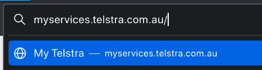
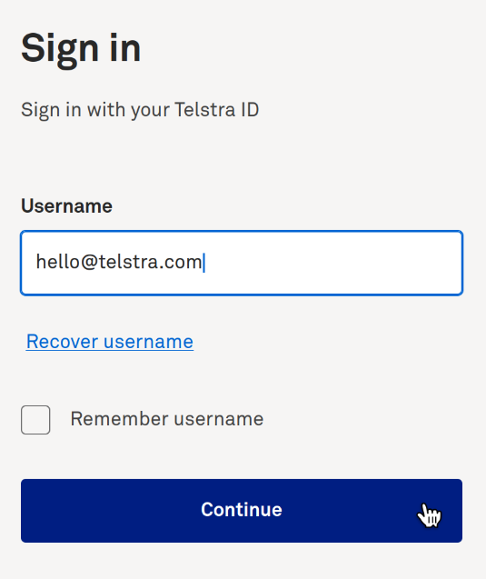
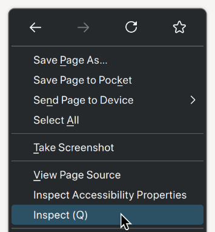
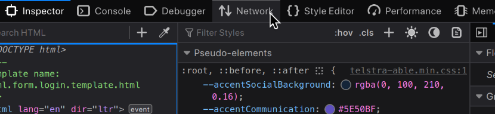
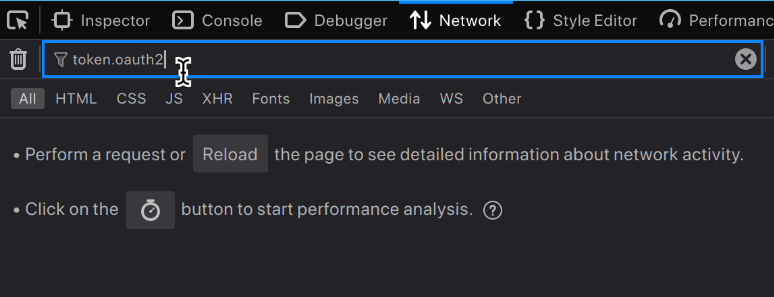
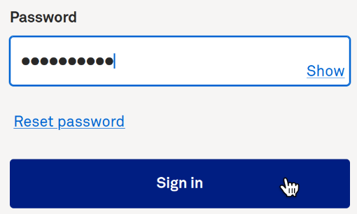
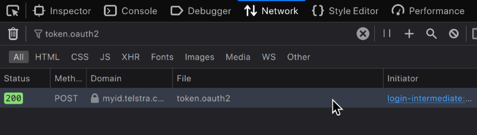
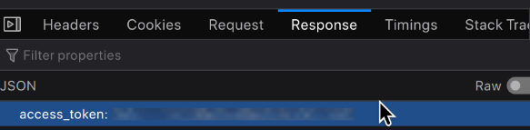
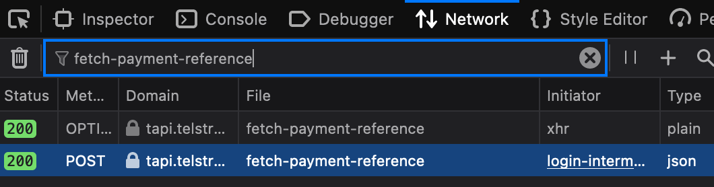
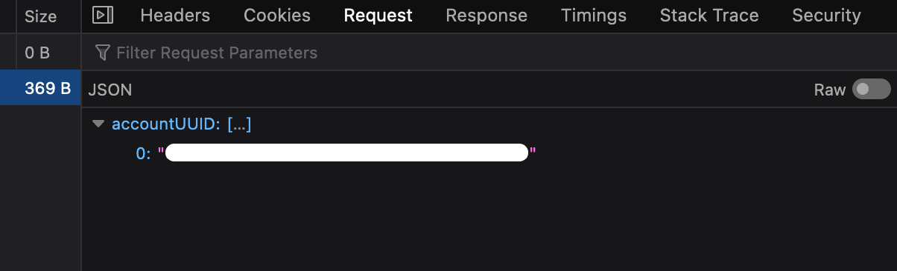

## Tutorial

This is a beginners' guide which assumes basic knowledge of computers. If you need help, please open a Discussion and tag it appropriately.

**Estimated time: 15 minutes**

### Step 1: Getting your Key
(Relevant for Firefox, Safari with Developer Mode enabled and Google Chrome/Chromium. Most other browsers support this method in some way or another, but they are not consistent with this documentation. Screenshots are from Firefox.)



___
Go to [https://myservices.telstra.com.au](https://myservices.telstra.com.au).

Enter your e-mail address, then press `Continue.`
___
___

___
Right-click anywhere on the following page, and click `Inspect` or `Inspect Element`, depending on your browser. The same can also be accomplished using `Ctrl/Cmd-Shift-I` in Firefox, or the F12 key in most browsers.
___
___


___
Find and click `Network` in the sidebar that opened.

In the `Filter URLs` box, type `token.oauth2.`
___
___



Enter your password and press `Sign in`.

After a few seconds, click on the entry that appears in the sidebar.
___
___


Then, navigate to `Response` and copy the value in `access_token`.
Paste it somewhere you can access later. Do not share it with anybody.

**The access token will expire after your session times out. If this happens, get the access token again using these steps..**
___
___



In the `Filter URLs` box, type `fetch-payment-reference` and click on the second item.

Then, navigate to `Request` in the new sidebar and copy the value in `accountUUID`.
Paste it somewhere you can access later. Do not share it with anybody.

Unlike the Access Token, the Account UUID is permanent and will not expire.

### Step 2: Using TelstraCallToCSV
TelstraCallToCSV requires a GNU/Linux, Windows or Mac computer with [Python 3](https://python.org/download) installed. **If you do not already have Python 3 installed, please download it using that link.**
	
**Required Reading**

Depending on your operating system, you need to open one of the following applications:

- GNU/Linux: The terminal emulator you have installed, such as Konsole or GNOME Terminal
- Windows: Command Prompt or PowerShell
- macOS: Terminal, or another terminal emulator you have installed such as iTerm2.

All of these applications will give you a text prompt that looks something like this:

GNU/Linux or macOS:
```sh
user@computer ~ $
```

Windows:
```
C:\>
```

When this tutorial says to 'run' a command, it means to paste it in to this application and press Enter.

**Installing**

We need to download and install TelstraCallToCSV. We can do this using Python's `pip` package manager, which allows us to easily install TelstraCallToCSV and its dependencies in a single command from a central software repository for usage with Python.

Run the following command to download and install TelstraCallToCSV from PyPi, the Python Package Index:

GNU/Linux or macOS:
```sh
python3 -m pip install telstracalltocsv
```

Windows:
```
py -m pip install telstracalltocsv
```

This command will output some text as it downloads and installs TelstraCallToCSV and its dependencies, but no interaction is required.

**Configuring**

TelstraCallToCSV has a built in configuration file which is not set up by default. Before running TelstraCallToCSV, you must set this up:

GNU/Linux or macOS:
```sh
python3 -m telstracalltocsv --configure
```

Windows:
```
py -m telstracalltocsv --configure
```

You will be prompted for your Account UUID and your Phone Number. Type or copy in the information, then press Enter.


**Running**

Finally, run TelstraCallToCSV, substituting `<key>` with your key gathered from Step 1.

GNU/Linux or macOS:
```sh
python3 -m telstracalltocsv <key>
```

Windows:
```
py -m telstracalltocsv <key>
```


TelstraCallToCSV will output something like the following as it downloads, by default, the maximum of 6 months call history.

```
:: Starting export...
   (1/6) 🢃 Downloading YYYYMM... Done.
         🖫 Saving YYYYMM.csv...  Done.

   (2/6) 🢃 Downloading YYYYMM... Done.
         🖫 Saving YYYYMM.csv...  Done.
         🗐 Proccessing page 2... Done.

   (3/6) 🢃 Downloading YYYYMM... Done.
         🖫 Saving YYYYMM.csv...  Done.

   (4/6) 🢃 Downloading YYYYMM... Done.
         🖫 Saving YYYYMM.csv...  Done.

   (5/6) 🢃 Downloading YYYYMM... Done.
         🖫 Saving YYYYMM.csv...  Done.
         🗐 Proccessing page 2... Done.

   (6/6) 🢃 Downloading YYYYMM... Done.
         🖫 Saving YYYYMM.csv...  Done.

:: Finished all jobs.
```

### You're finished! TelstraCallToCSV has exported your call logs sorted into months into the current folder.

**Extras**

TelstraCallToCSV also features other functions. These are explained using the `--help` or `-h` command. If you are unfamiliar with command-line interface programs, replace `<key>` from the previous step with `--help` or `-h`. You will see the following:

```
usage: TelstraCallToCSV [-h] [-c] [-v] [-C] [--configure] [-P PHONE] [-M MONTHS] [key]

A simple Python program to export Telstra call histories to CSV files.

positional arguments:
  key                   My Telstra session key

options:
  -h, --help            show this help message and exit
  -c, --copying         show the license information
  -v, --version         show the version information
  -C, --clean           clean all CSV files in the current directory- use with caution!
  --configure           write/create the configuration file
  -P PHONE, --phone PHONE
                        override the default account phone number in the config
  -M MONTHS, --months MONTHS
                        specify how many months back to download (default: 6, the max)

TelstraCallToCSV Copyright (c) 2023 capta1nt0ad. This program comes with ABSOLUTELY NO WARRANTY; for details type `telstracall --copying`. This is free software, and you are welcome to redistribute it under the conditions of the
GNU General Public License v3.
```

Most notably:

`--configure` allows you to reconfigure your Account UUID and Phone Number. (For advanced users: the configuration file is in JSON and is located in `~/.telstracall`.)

`--clean` will delete all the CSV files in the current directory. You should make sure there are no CSV files in the current directory before running TelstraCallToCSV, because if it fails, this will be automatically run.

`-P` or `--phone` allows you to specify a phone number to override the one in the configuration. Note that you still need to have a phone number in the configuration even with this option.

`-M` or `--months` allows you to download a specific number of months, rather than the default maximum of 6. (Telstra does not allow you to request back more than 6 months of data, and there is no way to work around this.)

___
___
 
*Coming Soon:*
### 👀 Look out for TelstraCallToCSV 3.0, which will feature a graphical user interface!

