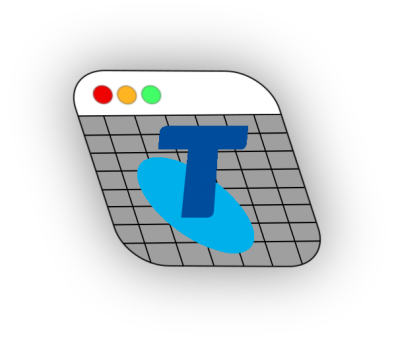

<p align="center">
	
</p>

<h1 align="center">TelstraCallToCSV</h1>

<h2 align="center">converts your Telstra prepaid call history to CSV files.</h2>

<h3 align="center"><a href="https://github.com/Capta1nT0ad/TelstraCallToCSV/blob/master/INSTRUCTIONS.md">Tutorial</a></h4>

<p align="center">
<a href="https://www.gnu.org/licenses/gpl-3.0.html"></a>
<a href="https://en.wikipedia.org/wiki/Free_and_open-source_software"></a>
</p>

TelstraCallToCSV is a Free and Open Source program for GNU/Linux, Windows and macOS that provides an easy command-line interface to download and export Telstra prepaid call histories to CSV files by utilising the same API that the My Telstra web interface uses to get information and our very own parser to save it to a CSV file.

## FAQ
### Q: Why does this exist?

A: A few years ago, Telstra upgraded (really?) their web interface and removed the ability to download call histories as CSV files for prepaid plans. I saw that many others online (including myself) had expressed their frustration with this change (on https://whirlpool.net and other sites), and after taking quick look at the JSON format for call history, it became clear that it would be trivial to build a utility like this to export the information efficiently to CSV files.

### Q: Are you stealing my login credentials?

A: The only request the device makes is to Telstra's own server to download the call history content. Other than that, no data ever leaves your device and *most importantly*, is never sent to a third-party server like mine.

This is the beauty of FOSS software: you yourself can review the code extremely easily and personally vet it. This program only defines two different HTTP requests and they are both to Telstra's API, where information like your Account UUID and Access Token are securely sent over HTTPS.

### Q: Is this legal / against Telstra's legal policies?

A: No.

I have attempted to look over all of Telstra's policies that would be relevant to this project and have found that the only usage of their web services that they specifically disallow is defined as usage that would distrupt the experience of other users.

What this program does is effectively indistinguishable from a normal My Testra user's activity on the Call History dashboard, so there is no distruption to Telstra's service from this program and especially no risk of your My Telstra account being denied access to their services.

### Q: What is the 'legacy' branch?

A: TelstraCallToCSV actually originated two years ago as a simple parser for the call history format of My Telstra. Recently, it has evolved into a '2.0' version which allows you to automatically fetch six months back of call history without having to manually feed information in and copy it out. The 'legacy' branch provides this old version of TelstraCallToCSV in case you want to feed in your own JSON file.

## Usage
**For a detailed guide to using TelstraCallToCSV, please see the <a href="https://github.com/Capta1nT0ad/TelstraCallToCSV/blob/master/INSTRUCTIONS.md">Tutorial</a>.**

Otherwise, the `--help` output from TelstraCallToCSV is below.

```
usage: TelstraCallToCSV [-h] [-c] [-v] [-C] [--configure] [-P PHONE] [-M MONTHS] [key]

A simple Python program to export Telstra call histories to CSV files.

positional arguments:
  key                   My Telstra session key

options:
  -h, --help            show this help message and exit
  -c, --copying         show the license information
  -v, --version         show the version information
  -C, --clean           clean all CSV files in the current directory- use with caution!
  --configure           write/create the configuration file
  -P PHONE, --phone PHONE
                        override the default account phone number in the config
  -M MONTHS, --months MONTHS
                        specify how many months back to download (default: 6, the max)

TelstraCallToCSV Copyright (c) 2023 capta1nt0ad. This program comes with ABSOLUTELY NO WARRANTY; for details type `telstracall --copying`. This is free software, and you are welcome to redistribute it under the conditions of the
GNU General Public License v3.
```


## License

```
TelstraCallToCSV converts your Telstra prepaid call history to CSV files.
Copyright (C) 2024 capta1nt0ad

This program is free software: you can redistribute it and/or modify
it under the terms of the GNU General Public License as published by
the Free Software Foundation, either version 3 of the License, or
(at your option) any later version.

This program is distributed in the hope that it will be useful,
but WITHOUT ANY WARRANTY; without even the implied warranty of
MERCHANTABILITY or FITNESS FOR A PARTICULAR PURPOSE.  See the
GNU General Public License for more details.

You should have received a copy of the GNU General Public License
along with this program.  If not, see <https://www.gnu.org/licenses/>.
```

Please see COPYING.md for more information.
